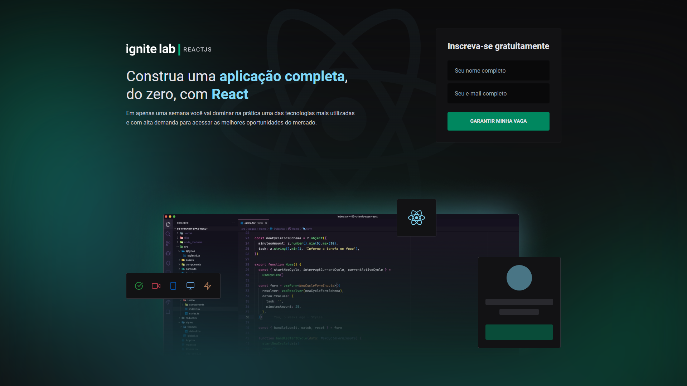

  <h1>Projeto Ignite Lab 02</h1>

  <a href="#-sobre">Sobre</a> &#xa0; | &#xa0;
  <a href="#inteface-de-visualização-de-vídeos">Visualização de Vídeos</a> &#xa0; | &#xa0;
  <a href="#skateboard-funcionalidades">Funcionalidades</a> &#xa0; | &#xa0;
  <a href="#rocket-tecnologias">Tecnologias</a> &#xa0; | &#xa0;
  <a href="#memo-licença">Licença</a> &#xa0; | &#xa0;
  <a href="https://github.com/PhabloFinotti" target="_blank">Autor</a>

 

## 🤔 Sobre ##

Projeto desenvolvido durante as aulas do Ignite lab 02 produzido pela <a href="https://rocketseat.com.br/"> Rocketseat</a>.
Neste evento vimos como usar tecnologias atuais e poderosas na construção de sistemas simples ou avançados.

## Inteface de visualização de vídeos

## :skateboard: Funcionalidades ##

:heavy_check_mark: Listar itens cadastrados no graphcms\
:heavy_check_mark: Executar vídeos cadastrados no graphcms\
:heavy_check_mark: Visualização de Vídeos utilizando biblioteca Vime JS\

## :rocket: Tecnologias ##

Abaixo poderá ter acesso às principais tecnologias usadas neste projeto

- [React](https://pt-br.reactjs.org/)
- [TypeScript](https://www.typescriptlang.org/)
- [Vite](https://vitejs.dev/)
- [Graphcms](https://graphcms.com/)
- [Apollo Client](https://www.apollographql.com/)
- [GraphQL](https://graphql.org/)
- [Vime](https://vimejs.com/)
- [Tailwind](https://tailwindcss.com/)
- [Phosphor Icons](https://phosphoricons.com/)
- [Graphql Generate Code](https://www.graphql-code-generator.com/)

## :memo: Licença ##

Este projeto está sob licença MIT. Para mais informações acesse [LICENSE](LICENSE.md).

Feito com :heart: por <a href="https://github.com/PhabloFinotti" target="_blank">Phablo Finotti</a>

&#xa0;

<a href="#top">Voltar ao topo</a>
